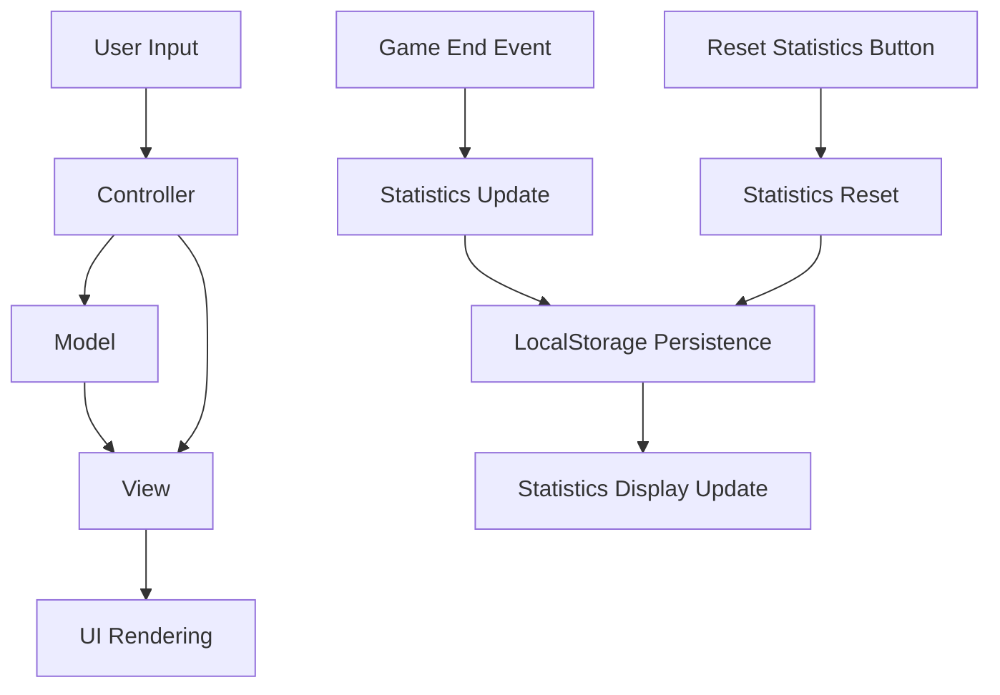

# Design Document: Game Statistics Tracking

## Overview

This document outlines the design for adding game statistics tracking to the Tic-tac-toe game. The feature will track and display the number of wins for each player (X and O) and the number of draws. The statistics will persist across game sessions using localStorage, allowing players to keep track of their performance over time.

## Architecture

The game statistics feature will integrate with the existing Model-View-Controller (MVC) architecture of the Tic-tac-toe game:

1. **Model**: Will be extended to include statistics data and methods for updating and resetting statistics.
2. **View**: Will be extended to include rendering of the statistics display and the reset statistics button.
3. **Controller**: Will be extended to handle statistics updates when games end and to process reset statistics requests.



## Components and Interfaces

### Game Statistics Model

The Game Statistics Model will maintain the statistics data:

- `xWins`: Number of wins by Player X
- `oWins`: Number of wins by Player O
- `draws`: Number of draws

#### Methods:

- `incrementXWins()`: Increments the X wins counter
- `incrementOWins()`: Increments the O wins counter
- `incrementDraws()`: Increments the draws counter
- `resetStatistics()`: Resets all statistics to zero
- `saveStatistics()`: Saves statistics to localStorage
- `loadStatistics()`: Loads statistics from localStorage

### Game Statistics View

The Game Statistics View will handle the rendering of the statistics:

- `renderStatistics()`: Updates the UI to display current statistics
- `createStatisticsSection()`: Creates the statistics section in the DOM
- `updateStatisticsDisplay()`: Updates the statistics display with current values
- `showResetStatisticsButton()`: Shows the reset statistics button
- `announceStatisticsChange()`: Announces statistics changes to screen readers

### Game Statistics Controller

The Game Statistics Controller will handle user interactions and statistics updates:

- `handleGameEnd(result)`: Updates statistics based on game result
- `handleResetStatisticsClick()`: Processes a request to reset statistics
- `initStatistics()`: Initializes the statistics feature

## Data Models

### Statistics Data Structure

The statistics will be stored in a simple object:

```javascript
{
  xWins: 0,
  oWins: 0,
  draws: 0
}
```

### LocalStorage Key

The statistics will be stored in localStorage using the key `ticTacToeStatistics`.

## Error Handling

The statistics feature will implement the following error handling strategies:

1. **LocalStorage Unavailability**: If localStorage is not available (e.g., in private browsing mode or if disabled), the game will still function but will display a message indicating that statistics cannot be saved between sessions.
2. **Data Corruption**: If the loaded statistics data is corrupted or in an unexpected format, the statistics will be reset to default values.
3. **Reset Confirmation**: To prevent accidental resets, a confirmation dialog will be shown before resetting statistics.

## Testing Strategy

The testing strategy will include:

1. **Unit Tests**:
   - Test statistics model methods (increment, reset, save, load)
   - Test statistics view rendering

2. **Integration Tests**:
   - Test interaction between game end events and statistics updates
   - Test persistence of statistics between page reloads

3. **User Interface Tests**:
   - Test statistics display in different viewport sizes
   - Test statistics display in light and dark modes
   - Test reset statistics button functionality

4. **Edge Cases**:
   - Test behavior when localStorage is unavailable
   - Test behavior with corrupted localStorage data
   - Test behavior with very large numbers (many games played)

5. **Accessibility Tests**:
   - Test screen reader announcements for statistics updates
   - Test keyboard navigation for the reset statistics button
   - Test color contrast for statistics display

## User Interface Design

The statistics section will be added to the game UI below the game board and above the instructions section:

```
+-------------------+
|                [Light/Dark]
|     Tic-tac-toe   |
+-------------------+
| Status: Player X's turn |
+-------------------+
|     |     |     |
|  X  |  O  |  X  |
|     |     |     |
+-------------------+
|     |     |     |
|  O  |  X  |     |
|     |     |     |
+-------------------+
|     |     |     |
|     |     |  O  |
|     |     |     |
+-------------------+
|    [Reset Game]   |
+-------------------+
| Game Statistics   |
| Player X: 5 wins  |
| Player O: 3 wins  |
| Draws: 2          |
| [Reset Statistics]|
+-------------------+
| How to play with keyboard |
| • Use Tab to navigate... |
| • Use Arrow keys to...   |
| • Press Enter or Space...|
| • Press Tab to navigate..|
+-------------------+
```

### Statistics Section Design

The statistics section will have the following design elements:

1. **Section Header**: "Game Statistics" heading
2. **Statistics Display**: Three lines showing X wins, O wins, and draws
3. **Reset Button**: A button to reset all statistics
4. **Visual Styling**:
   - Consistent with the game's overall design
   - Player X statistics in blue (matching X's color)
   - Player O statistics in red (matching O's color)
   - Draws statistics in neutral color
   - Reset button styled similarly to the Reset Game button but smaller

### Responsive Design Considerations

The statistics section will adapt to different screen sizes:

1. **Desktop**: Full-width statistics section below the game board
2. **Tablet**: Maintained proportions with slightly reduced text size
3. **Mobile**: Compact layout with smaller text and button

## Accessibility Considerations

The statistics feature will implement the following accessibility features:

1. **Screen Reader Support**:
   - ARIA live regions for statistics updates
   - Descriptive labels for all statistics elements
   - Announcements for significant changes (e.g., "Statistics reset")

2. **Keyboard Navigation**:
   - Proper tab order including the reset statistics button
   - Clear focus indicators for the reset button
   - Keyboard shortcuts for common actions

3. **Visual Design**:
   - Sufficient color contrast for all text
   - Visual indicators that don't rely solely on color
   - Consistent styling with the rest of the game

4. **ARIA Attributes**:
   - `aria-live` regions for dynamic content updates
   - `aria-label` for descriptive element labels
   - `aria-pressed` for button states
