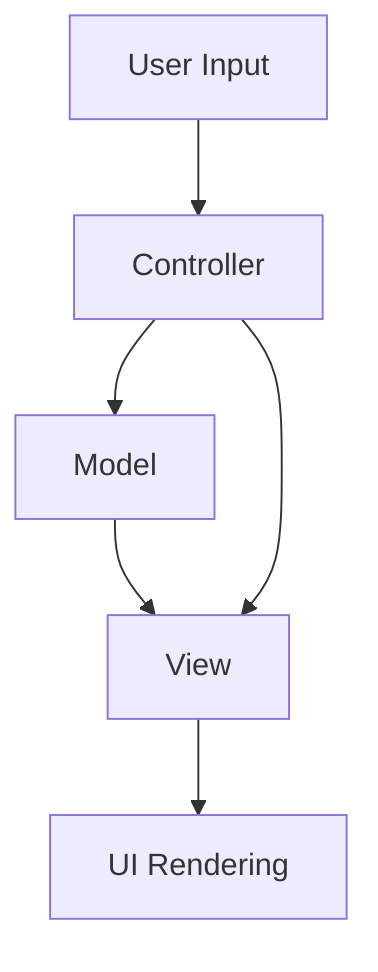

# Design Document: Tic-tac-toe Game

## Overview

This document outlines the design for a Tic-tac-toe game implementation based on the requirements. The game will be implemented as a web application using HTML, CSS, and JavaScript to provide an interactive and responsive user experience. The design prioritizes accessibility, responsive design, and a clean user interface with both light and dark mode options.

## Architecture

The Tic-tac-toe game will follow a simple Model-View-Controller (MVC) architecture:

1. **Model**: Represents the game state, including the board, current player, and game status.
2. **View**: Handles the rendering of the game board and UI elements, including status messages, game over overlay, and accessibility features.
3. **Controller**: Manages game logic, processes user input, and updates the model and view accordingly.

Additionally, the application will include accessibility features and utility functions to enhance the user experience.



## Components and Interfaces

### Game Model

The Game Model will maintain the state of the game:

- `board`: 2D array representing the 3x3 grid (null for empty, 'X' or 'O' for marked)
- `currentPlayer`: String indicating the current player ('X' or 'O')
- `gameStatus`: String indicating the game status ('in_progress', 'win_X', 'win_O', 'draw')
- `winningCombination`: Array of cell positions that form the winning combination (if any)

#### Methods:

- `makeMove(row, col)`: Attempts to place the current player's mark at the specified position
- `checkWin()`: Checks if the current player has won
- `checkDraw()`: Checks if the game has ended in a draw
- `switchPlayer()`: Switches the current player
- `reset()`: Resets the game to its initial state

### Game View

The Game View will handle the rendering of the game:

- `renderBoard()`: Updates the UI to reflect the current state of the board
- `updateStatus()`: Updates the game status message
- `highlightWinningCombination()`: Highlights the winning cells
- `showResetButton()`: Shows or hides the reset button based on game state
- `showGameOverMessage()`: Displays the game over message overlay
- `hideGameOverMessage()`: Hides the game over message overlay
- `disableCells()`: Disables all cells when the game ends

### Game Controller

The Game Controller will handle user interactions and game logic:

- `handleCellClick(row, col)`: Processes a player's attempt to mark a cell
- `handleResetClick()`: Processes a request to reset the game
- `initGame()`: Initializes the game
- `focusCell(row, col)`: Manages keyboard focus for accessibility
- `announceToScreenReader(message, priority)`: Announces game events to screen readers
- `describeWinningCombination(combination)`: Creates human-readable descriptions of winning combinations

## Data Models

### Board Representation

The game board will be represented as a 3x3 2D array:

```javascript
[
  [null, null, null],
  [null, null, null],
  [null, null, null],
];
```

Where:

- `null` represents an empty cell
- `'X'` represents a cell marked by Player X
- `'O'` represents a cell marked by Player O

### Winning Combinations

The game will check for wins by examining the following combinations:

1. Horizontal rows: `[[0,0], [0,1], [0,2]]`, `[[1,0], [1,1], [1,2]]`, `[[2,0], [2,1], [2,2]]`
2. Vertical columns: `[[0,0], [1,0], [2,0]]`, `[[0,1], [1,1], [2,1]]`, `[[0,2], [1,2], [2,2]]`
3. Diagonals: `[[0,0], [1,1], [2,2]]`, `[[0,2], [1,1], [2,0]]`

## Error Handling

The game will implement the following error handling strategies:

1. **Invalid Moves**: When a player attempts to mark an already marked cell, the move will be ignored, and a user-friendly message will be displayed.
2. **Out-of-Turn Moves**: The UI will clearly indicate whose turn it is, and the controller will enforce turn order.
3. **Game End State**: When the game has ended (win or draw), all cells will be disabled to prevent further moves. This will be implemented through multiple mechanisms:
   - Setting `pointer-events: none` via CSS to prevent mouse interactions
   - Adding `disabled` and `aria-disabled` attributes for accessibility
   - Visually styling disabled cells to indicate they cannot be interacted with
   - Programmatically blocking any click events that might still occur
   - Disabling keyboard navigation with arrow keys on the game board
   - Ensuring the "Reset Game" button is the only interactive element
   - Setting appropriate tab index values to direct focus to the reset button
4. **UI Responsiveness**: The UI will provide immediate feedback for user actions, including visual cues for valid/invalid moves.

## Testing Strategy

The testing strategy will include:

1. **Unit Tests**:
   - Test game model logic (win detection, draw detection, player switching)
   - Test individual UI component rendering

2. **Integration Tests**:
   - Test interaction between model and view
   - Test game flow from start to finish

3. **User Interface Tests**:
   - Test responsiveness of the UI
   - Test accessibility features
   - Test dark mode functionality
   - Test visual indicators for different game states

4. **Edge Cases**:
   - Test behavior when clicking on already marked cells
   - Test game reset functionality during various game states
   - Test input validation for various edge cases

5. **Accessibility Tests**:
   - Test keyboard navigation
   - Test screen reader announcements
   - Test focus management
   - Test ARIA attributes

6. **Responsive Design Tests**:
   - Test layout at different viewport sizes
   - Test touch interactions on mobile devices
   - Test font sizes and spacing across devices

## User Interface Design

The UI will consist of:

1. **Theme Toggle**: A Light/Dark mode toggle switch positioned in the top-right corner of the page
2. **Game Board**: A visually distinct 3x3 grid with clear cell boundaries
3. **Status Display**: A message area showing whose turn it is or the game result
4. **Game Over Overlay**: A semi-transparent overlay that appears when the game ends, displaying the result
5. **Reset Button**: A button to reset the game, visible at all times but emphasized when the game ends
6. **Instructions Section**: Provides keyboard navigation instructions for accessibility
7. **Visual Feedback**:
   - Hover effects on empty cells to indicate they can be selected
   - Clear visual distinction between X and O marks
   - Highlighting of the winning combination when a player wins
   - Distinct visual indicators for the current player's turn (blue for X, red for O)
   - Visual indication when the game has ended (win or draw)
   - Disabled appearance for cells when the game has ended

```
+-------------------+
|                [Light/Dark]
|     Tic-tac-toe   |
+-------------------+
| Status: Player X's turn |
+-------------------+
|     |     |     |
|  X  |  O  |  X  |
|     |     |     |
+-------------------+
|     |     |     |
|  O  |  X  |     |
|     |     |     |
+-------------------+
|     |     |     |
|     |     |  O  |
|     |     |     |
+-------------------+
|    [Reset Game]   |
+-------------------+
| How to play with keyboard |
| • Use Tab to navigate... |
| • Use Arrow keys to...   |
| • Press Enter or Space...|
| • Press Tab to navigate..|
+-------------------+
```

## Responsive Design

The game will be designed to work well on various screen sizes:

1. **Desktop**: Full-sized board with ample spacing
2. **Tablet**: Slightly reduced size but maintaining proportions
3. **Mobile**: Optimized layout with touch-friendly cell sizes

## Accessibility Considerations

The game will implement the following accessibility features:

1. **Keyboard Navigation**: Players can use arrow keys to navigate the board and Enter/Space to mark cells
2. **Screen Reader Support**: Proper ARIA labels and announcements for game state changes
3. **Color Contrast**: Ensuring sufficient contrast between game elements
4. **Focus Indicators**: Clear visual indicators for keyboard focus, with colors matching the current player (blue for X, red for O)
5. **Theme Toggle**: A Light/Dark mode toggle switch positioned in a fixed location for easy access, with visual indicators (sun/moon icons) and persistent preference storage
6. **Keyboard Instructions**: Clear instructions for keyboard navigation displayed on the page
7. **ARIA Attributes**: Comprehensive ARIA attributes for screen reader compatibility, including:
   - `role="grid"` and `role="gridcell"` for the game board
   - `aria-label` for descriptive cell labels
   - `aria-live` regions for dynamic content updates
   - `aria-checked` for toggle switches
   - `aria-hidden` for content that should be hidden from screen readers

### Theme Toggle Icon Positioning

The theme toggle icons (sun ☀️ and moon 🌙) will be properly centered within the toggle switch to ensure a polished and professional appearance:

1. **Flexbox Centering**: Using `display: flex` with `justify-content: center` and `align-items: center` to center the icons both horizontally and vertically
2. **Precise Positioning**: Aligning the icons with the toggle knob positions for visual consistency
3. **Responsive Design**: Ensuring the icons remain centered across different screen sizes and zoom levels
4. **Cross-Browser Compatibility**: Adding vendor prefixes for flexbox properties to ensure consistent behavior across browsers

#### Current vs. Improved Icon Positioning

Current positioning has the icons misaligned:

```
+---------------------------+
|                           |
|  +---------------------+  |
|  |                     |  |
|  | ☀️                 |  |
|  |                     |  |
|  +---------------------+  |
|                           |
+---------------------------+
```

Improved positioning centers the icons properly:

```
+---------------------------+
|                           |
|  +---------------------+  |
|  |                     |  |
|  |         ☀️          |  |
|  |                     |  |
|  +---------------------+  |
|                           |
+---------------------------+
```
