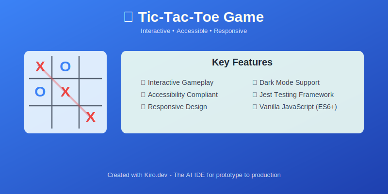

# 🎮 Tic-tac-toe Game

A simple, accessible Tic-tac-toe game built with HTML, CSS, and JavaScript.



Created with [Kiro.dev](https://kiro.dev) - The AI IDE for prototype to production.

## How to Play

1. **Open the Game**: Open the `index.html` file in your web browser.

2. **Game Rules**:
   - Players take turns placing X and O marks on a 3×3 grid
   - Player X always goes first
   - First player to get 3 marks in a row (horizontally, vertically, or diagonally) wins
   - If all cells are filled with no winner, the game ends in a draw

3. **Controls**:
   - **Mouse**: Click on any empty cell to place your mark
   - **Keyboard**:
     - Arrow keys to navigate between cells
     - Enter/Space to select a cell
     - Tab to navigate to the Reset button
   - **Dark Mode**: Click the "Dark Mode" button to toggle between light and dark themes
   - After game ends, only the Reset button is interactive

4. **Reset Game**: Click the "Reset Game" button to start a new game

## Features

- **Interactive Gameplay**: Real-time visual feedback with highlighted winning combinations
- **Accessibility Compliance**: Keyboard navigation and screen reader support
- **Responsive Design**: Optimized user experience across desktop and mobile devices
- **Dark Mode Support**: Toggle between light and dark themes for comfortable viewing
- **State Management**: Robust game state handling with clear user feedback

## Technical Architecture

- **Frontend Technologies**: HTML5, CSS3, and vanilla JavaScript (ES6+)
- **Architecture Pattern**: Implements Model-View-Controller (MVC) for separation of concerns
- **Testing Framework**: Comprehensive [Jest](https://jestjs.io/) test suite with unit and integration tests
- **Code Quality**: Enforced code formatting and style consistency via [Prettier](https://prettier.io/) and [Husky](https://typicode.github.io/husky/)

## Development

```bash
# Install dependencies
npm install

# Run tests
npm test

# Build the project for production (minify and copy files to public folder)
npm run build
```

## Browser Support

The game works with modern browsers
